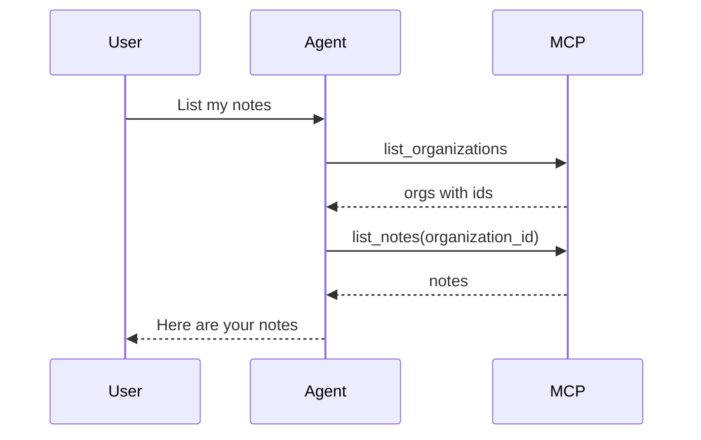

# MCP server template

Scaffolds a Model Context Protocol server as a Supabase Edge Function. The function speaks JSON-RPC over HTTP and exposes tools that are declared through a small registry.

This composes with the **Agent** template: when the mcp-server template is installed, `agent-chat` registers it automatically at `${SUPABASE_URL}/functions/v1/mcp-server` and forwards the caller's JWT. No client-side MCP configuration is required. You can also register additional servers in `public.agent_mcp_servers`.

## Includes

- `supabase/functions/mcp-server/index.ts` — JSON-RPC entrypoint handling `initialize`, `tools/list`, and `tools/call`
- `supabase/functions/mcp-server/registry.ts` — `registerTool` API and tool typings
- `supabase/functions/mcp-server/user-client.ts` — service-role and user-scoped Supabase clients
- `supabase/functions/mcp-server/tools/` — one file per tool, imported from `tools/index.ts`

## User-scoped tools (RLS)

`ToolContext` provides two clients:

| Client | Use |
| ------ | --- |
| `supabase` | Service role — bypasses RLS. Use for schema introspection (`list_tables`) or admin-only operations. |
| `userSupabase` | Created from the request `Authorization` header. Use for queries against RLS-protected tables. |

`agent-chat` forwards the user's JWT when calling this server. Tools that read or write tenant data should use `userSupabase` and return a clear error when it is missing:

```ts
async handler(args, { userSupabase }) {
  if (!userSupabase) {
    throw new Error('Authorization header with user JWT is required')
  }

  const { data, error } = await userSupabase.from('notes').select('*')
  if (error) throw new Error(error.message)
  return data
}
```

## Multi-tenant apps

Use this section when you compose **mcp-server** with **multi-tenant-rbac** (or any schema where tenant-owned rows include `organization_id`).

MCP clients (Cursor, Claude Desktop, `agent-chat`) receive the caller's JWT but do not know which organization is active. Do not ask end users to paste organization UUIDs into chat. Instead, register **discovery tools** the agent can call before tenant-scoped operations.

Recommended discovery tools:

- `list_organizations` — returns organizations the caller belongs to (id, name, slug, role)
- `get_organization` (optional) — resolve an organization by slug or name when the user says "Acme"

Tenant CRUD tools (`list_notes`, `create_project`, and so on) may accept `organization_id` as a tool argument, but the **agent** should fill it in after calling `list_organizations`, not the human.



### Example `list_organizations` tool

Create `tools/list-organizations.ts`, import it from `tools/index.ts`, and register:

```ts
registerTool({
  name: 'list_organizations',
  description:
    'List organizations the current user belongs to. Call this before other tenant tools when organization context is unknown.',
  inputSchema: { type: 'object', properties: {}, additionalProperties: false },
  async handler(_args, { userSupabase }) {
    if (!userSupabase) {
      throw new Error('Authorization header with user JWT is required')
    }

    const { data, error } = await userSupabase
      .from('organization_members')
      .select('role, organizations(id, name, slug)')

    if (error) throw new Error(error.message)
    return data
  },
})
```

This example assumes the **multi-tenant-rbac** schema (`organization_members` joined to `organizations`). See that template's readme for RLS and permission patterns.

### Tool design tips

- Prefer **RLS + `userSupabase`** for reads so rows are scoped by membership. Pass `organization_id` only when inserting or when a query must target one organization.
- Return human-friendly fields (`name`, `slug`) from discovery tools so the agent can match "my Acme workspace" without the user knowing UUIDs.
- If the user belongs to exactly one organization, the agent can often proceed without asking — but still expose `list_organizations` for reliability.

### Connecting from Cursor

Point your MCP client at the Edge Function URL and pass the user's JWT in headers. No organization id is required in MCP config when discovery tools are present.

```json
{
  "mcpServers": {
    "project": {
      "url": "https://<ref>.supabase.co/functions/v1/mcp-server",
      "headers": {
        "Authorization": "Bearer <user-access-token>"
      }
    }
  }
}
```

For local development, use `http://127.0.0.1:<api-port>/functions/v1/mcp-server` from `supabase status`. Refresh the access token when it expires, same as any JWT-backed MCP connection.

## Adding a tool

1. Create a new file under `supabase/functions/mcp-server/tools/`, e.g. `tools/my-tool.ts`.
2. Call `registerTool({ name, description, inputSchema, handler })` at module scope.
3. Import the new file from `tools/index.ts` so it self-registers at boot.

## Local endpoint

After `supabase start`, the MCP server is available at:

```text
http://127.0.0.1:<api-port>/functions/v1/mcp-server
```

Run `supabase status` for the API port and Mailpit URL for your project.

## Dependencies

Requires **database**, **api**, and **functions**.
